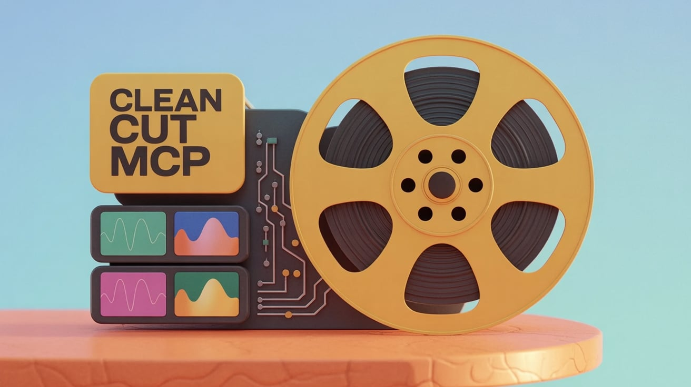

# Clean-Cut-MCP: AI Video Generation for Claude Desktop



**Transform natural language into professional videos using Claude Desktop + Remotion.**

Simply describe your animation, and watch Claude create stunning React-powered videos in a persistent studio environment.

  

## Quick Start

**Windows:**
```powershell
# Download and run Windows installer
iwr "https://github.com/endlessblink/clean-cut-mcp/releases/latest/download/install-windows.ps1" -o "install.ps1"
.\install.ps1
```

**Linux/macOS:**
```bash
# Download and run Linux/macOS installer
curl -L -o install.ps1 "https://github.com/endlessblink/clean-cut-mcp/releases/latest/download/install.ps1"
pwsh ./install.ps1
```

**Result:** Remotion Studio at http://localhost:6970 + Claude Desktop integration

## Installation Overview

**Prerequisites**: Docker Desktop (Windows/Mac/Linux)

```bash
# 1. Pull and run the container
docker run -d --name clean-cut-mcp --restart unless-stopped \
  -p 6970:6970 \
  -v ./clean-cut-exports:/workspace/out \
  endlessblink/clean-cut-mcp:latest

# 2. Configure Claude Desktop (one-time setup)
# Add MCP server to claude_desktop_config.json

# 3. Start creating videos
# Ask Claude: "Create a sliding text animation"
```

**Detailed setup instructions**: [Setup Guide](docs/SETUP-GUIDE.md)

## Use Cases

### Content Creators
- **YouTube Intros**: Professional animated intros with your branding
- **Social Media**: Quick animations for Instagram, TikTok stories  
- **Explainer Videos**: Animated sequences for complex topics
- **Brand Animations**: Logo reveals, product showcases

### Marketers & Businesses  
- **Ad Creatives**: Animated ads for multiple platforms
- **Presentation Graphics**: Data visualizations, animated charts
- **Website Assets**: Loading animations, interactive elements
- **A/B Testing**: Generate multiple animation variants quickly

### Educators & Trainers
- **Course Content**: Visual explanations of complex concepts
- **Interactive Lessons**: Animated diagrams and processes
- **Student Projects**: Help students create professional presentations
- **Training Materials**: Animated guides and tutorials

## Architecture & Technical Details

### System Design
```
Claude Desktop (Windows/Mac/Linux)
    ↓ MCP Protocol (STDIO transport)
Docker Container (clean-cut-mcp)
    ↓ Internal Services
Remotion Studio (Port 6970) + MCP Server + Node.js Runtime
    ↓ Volume Mount
./clean-cut-exports/ (Your Videos)
```

### Container Specifications
- **Base**: Node.js 22 with Chrome/Chromium for video rendering
- **Ports**: 6970 (Remotion Studio)
- **Volumes**: `/workspace/out` mounted to `./clean-cut-exports/`
- **Resources**: ~512MB RAM, 1GB disk space
- **Restart Policy**: `unless-stopped` for reliability

### MCP Integration
- **Transport**: STDIO via Docker exec (most stable)
- **Tools**: 4 core tools for animation generation and management
- **Error Handling**: Graceful fallbacks, detailed error messages
- **Logging**: Container logs available via `docker logs clean-cut-mcp`

## Comparison with Alternatives

| Approach | Pros | Cons | Best For |
|----------|------|------|----------|
| **Clean-Cut-MCP** | Visual workflow, image integration, persistent studio | Docker requirement | Creators who want GUI experience |
| **Claude Code + Remotion** | Simple npm setup, no Docker | Command-line only, no image paste | Developers comfortable with terminal |
| **Web-based AI Video** | No installation | Monthly fees, limited customization | Casual users, simple animations |
| **Traditional Video Editors** | Full-featured | Manual work, steep learning curve | Professional video production |

## Getting Started

1. **[Setup Guide](docs/SETUP-GUIDE.md)** - Install Docker Desktop and configure Clean-Cut-MCP
2. **[User Guide](docs/USER-GUIDE.md)** - Learn the MCP tools and create your first animation  
3. **[Examples](docs/EXAMPLES.md)** - Sample animations and use cases
4. **[Troubleshooting](docs/TROUBLESHOOTING.md)** - Common issues and solutions

## Community & Support

- **GitHub Issues**: Bug reports and feature requests
- **Discussions**: Share animations, ask questions
- **Docker Hub**: Pre-built container images
- **Documentation**: Comprehensive guides and examples

## Contributing

Clean-Cut-MCP is open source and welcomes contributions:
- **Bug Reports**: Found an issue? Please report it
- **Feature Requests**: Ideas for new MCP tools or capabilities
- **Documentation**: Help improve setup guides and examples
- **Code**: Container improvements, new animation templates

## License

**This project uses Remotion**, which has special licensing requirements:

- **Free for**: Individuals, organizations ≤3 employees, non-profits, evaluation
- **Company license required**: For-profit organizations >3 employees
- **Details**: Check [remotion.pro](https://remotion.pro) for complete licensing terms

**Clean-Cut-MCP container/MCP server code**: MIT License
**Remotion dependency**: Subject to Remotion's license terms

Please review Remotion's licensing requirements before commercial use.

---

**Ready to start creating?** → [Setup Guide](docs/SETUP-GUIDE.md)

**Questions or issues?** → [Troubleshooting](docs/TROUBLESHOOTING.md)

**Want to see examples?** → [Examples](docs/EXAMPLES.md)
